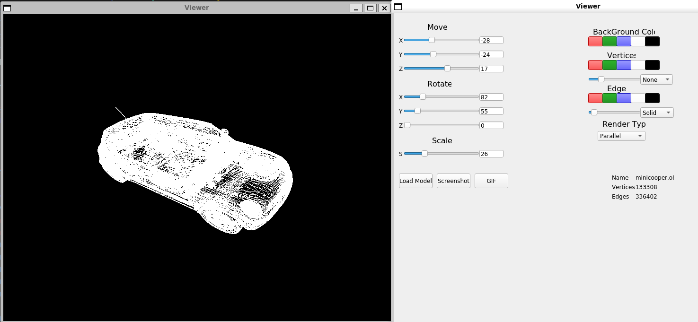

# 3DViewer v2.0

Программа для визуализации каркасных 3D-моделей в трехмерном пространстве с поддержкой аффинных преобразований и настраиваемым интерфейсом.



## Особенности

- **Загрузка моделей** в формате OBJ (вершины и поверхности)
- **Аффинные преобразования**: перемещение, поворот, масштабирование
- **Настройки отображения**: тип проекции, стили линий и вершин, цвета
- **Сохранение изображений** в форматах BMP и JPEG
- **Запись GIF-анимации** пользовательских преобразований
- **Высокая производительность**: обработка моделей до 1,000,000 вершин

## Архитектура

Проект реализован с использованием паттерна **MVC** и следующих паттернов проектирования:
- **Фасад** - упрощение интерфейса для работы с 3D-движком
- **Стратегия** - различные алгоритмы рендеринга и проекции
- **Команда** - обработка пользовательских действий

**Структура:**
- **Model** - логика обработки 3D-данных и трансформаций
- **View** - графический интерфейс на Qt5/Qt6
- **Controller** - связующий слой между UI и бизнес-логикой

## Функциональность

### Основные возможности
- Загрузка OBJ-файлов через диалог выбора файла
- Отображение информации о модели (файл, количество вершин и рёбер)
- Интерактивное управление камерой и объектом
- Режимы проекции: параллельная и центральная

### Преобразования
- **Перемещение** по осям X, Y, Z
- **Поворот** относительно осей X, Y, Z
- **Масштабирование** с заданным коэффициентом

### Настройки отображения
- **Рёбра**: тип линии (сплошная/пунктирная), цвет, толщина
- **Вершины**: отображение (нет/круг/квадрат), цвет, размер
- **Фон**: настраиваемый цвет
- **Автосохранение** настроек между сессиями

### Экспорт
- **Изображения**: сохранение в BMP и JPEG
- **GIF-анимация**: запись преобразований (640x480, 10fps, 5s)

## Сборка и установка

### Требования
- C++17 компилятор (g++/clang++)
- Qt5/Qt6 Development packages
- OpenGL support
- Google Test (для тестирования)

### Linux/WSL
```bash
# Установка зависимостей (Ubuntu/Debian)
sudo apt update
sudo apt install build-essential qt5-default libqt5opengl5-dev libgtest-dev

# Для Qt6 (опционально)
sudo apt install qt6-base-dev libqt6openglwidgets6-dev

# Сборка
make all   / make        # Полная сборка с тестами
make install       # Установка в систему
make uninstall     # Удаление

# Запуск
./build/Viewer     # Или после установки: 3dviewer
```

### Управление проектом
```bash
make clean         # Очистка временных файлов
make test          # Запуск unit-тестов
make dvi           # Открытие документации
make dist          # Создание дистрибутива
```


## Примеры моделей

Программа тестировалась на различных OBJ-моделях:
- Простые геометрические фигуры (куб, сфера, пирамида)
- Архитектурные объекты
- Сложные полигональные модели
- Высокодетализированные меши

